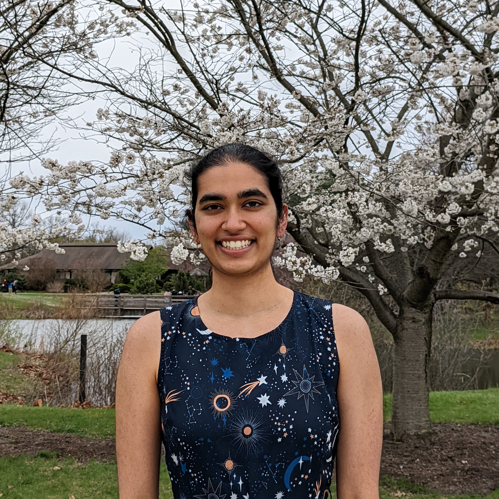

---
# Feel free to add content and custom Front Matter to this file.
# To modify the layout, see https://jekyllrb.com/docs/themes/#overriding-theme-defaults

layout: default
---

Hi! I am a sixth-year Computer Science PhD Candidate at University of
California, Berkeley, advised by [Chris
Fletcher](http://cwfletcher.github.io/). I work on understanding efficient
implementations of domain-specific kernels with a focus on building
abstractions that unify a wide variety of kernels and accelerator designs into
a small set of primitives, in collaboration with [Joel
Emer](http://people.csail.mit.edu/emer/), [Michael
Pellauer](https://dblp.org/pid/22/3969.html), and [Toluwa
Odemuyiwa](https://www.todemuyiwa.com/). I have applied this analysis to a
range of domains—including [sparse tensor
algebra](https://arxiv.org/abs/2304.07931),
[transformers](https://arxiv.org/abs/2406.10491), RTL simulation, and fully
homomorphic encryption—and accelerator backends designed by both academia and
[industry](https://www.linkedin.com/posts/amazon-web-services_aws-ucberkeley-trainium-tuesday-activity-7322984830038700032-SOZ6).

I transferred to UC Berkeley in January 2024 following my advisor, before
which, I was a student at University of Illinois Urbana-Champaign.  There, I
worked on [hardware
security](https://dl.acm.org/doi/abs/10.1109/ISCA52012.2021.00035) and began my
research on domain-specific kernels.

Before coming to the University of Illinois, I completed my B.S. in Computer
Science from Harvey Mudd College in 2020. There, I worked with [Chris
Clark](https://www.lair.hmc.edu/chris-clark) in the [Lab for Autonomous and
Intelligent Robotics](https://www.lair.hmc.edu/). Additionally, for my senior
capstone project, I added a [numerical programming
library](https://factor.netlify.app/book/about/tensors/README.md) to the
programming language [Factor](https://factorcode.org/).

In my free time, I enjoy cooking, bouldering, doing jigsaw puzzles, traveling
with my family, studying Korean, and [social
dancing](https://www.wcia.com/ciliving-tv/get-dancing-with-illini-swing-society/).

Please feel free to reach out to me by email at nandeeka [at] berkeley [dot]
edu, on [GitHub](https://github.com/nandeeka), or on
[LinkedIn](https://www.linkedin.com/in/nandeeka-nayak/).

